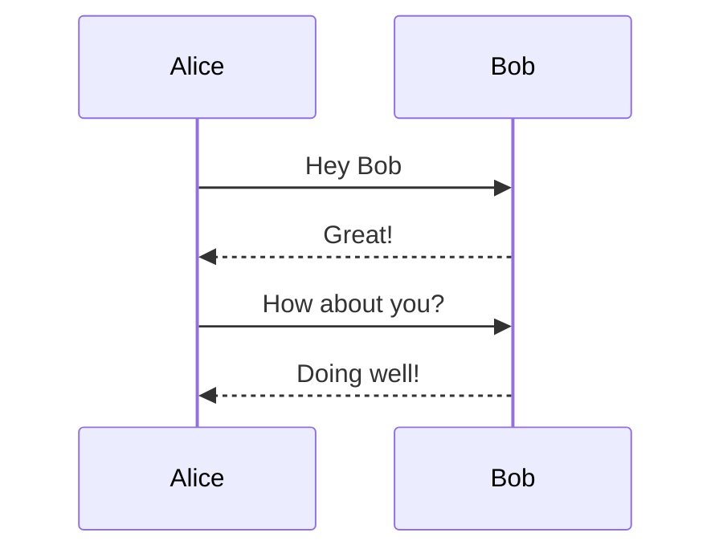

## Features

### Diagrams
<pre>

</pre>


### Charts

<pre>
```chart
{
  "type": "pie",
  "data": {
    "labels": [
      "Red",
      "Blue",
      "Yellow"
    ],
    "datasets": [
      {
        "data": [
          300,
          50,
          100
        ],
        "backgroundColor": [
          "#FF6384",
          "#36A2EB",
          "#FFCE56"
        ],
        "hoverBackgroundColor": [
          "#FF6384",
          "#36A2EB",
          "#FFCE56"
        ]
      }
    ]
  }
}
```
</pre>

```chart
{
  "type": "pie",
  "data": {
    "labels": [
      "Red",
      "Blue",
      "Yellow"
    ],
    "datasets": [
      {
        "data": [
          300,
          50,
          100
        ],
        "backgroundColor": [
          "#FF6384",
          "#36A2EB",
          "#FFCE56"
        ],
        "hoverBackgroundColor": [
          "#FF6384",
          "#36A2EB",
          "#FFCE56"
        ]
      }
    ]
  }
}
```

### Syntax Highlighting

<pre>
```json
{
  "@context": "https://www.w3.org/ns/did/v1",
  "id": "did:example:123456789abcdefghi",
  "authentication": [{
    "id": "did:example:123456789abcdefghi#keys-1",
    "type": "RsaVerificationKey2018",
    "controller": "did:example:123456789abcdefghi",
    "publicKeyPem": "-----BEGIN PUBLIC KEY...END PUBLIC KEY-----\r\n"
  }],
  "service": [{
    "id":"did:example:123456789abcdefghi#vcs",
    "type": "VerifiableCredentialService",
    "serviceEndpoint": "https://example.com/vc/"
  }]
}
```
</pre>

```json
{
  "@context": "https://www.w3.org/ns/did/v1",
  "id": "did:example:123456789abcdefghi",
  "authentication": [{ 
    "id": "did:example:123456789abcdefghi#keys-1",
    "type": "RsaVerificationKey2018",
    "controller": "did:example:123456789abcdefghi",
    "publicKeyPem": "-----BEGIN PUBLIC KEY...END PUBLIC KEY-----\r\n"
  }],
  "service": [{
    "id":"did:example:123456789abcdefghi#vcs",
    "type": "VerifiableCredentialService",
    "serviceEndpoint": "https://example.com/vc/"
  }]
}
```