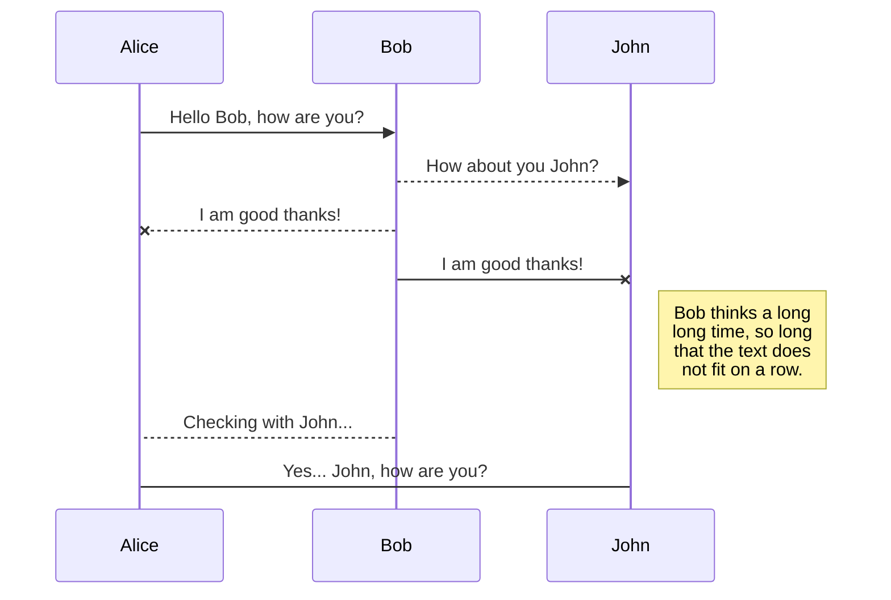
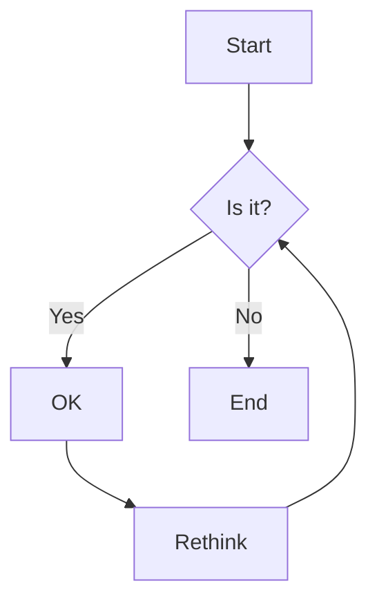

Spec-Up Example
==================

**Specification Status:** Strawman

**Latest Draft:**
  [https://csuwildcat.github.io/spec-up](https://csuwildcat.github.io/spec-up)

Editors:
~ [Daniel Buchner](https://www.linkedin.com/in/dbuchner/)
<br>

Participate:
~ [GitHub repo](https://github.com/csuwildcat/spec-up)
~ [File a bug](https://github.com/csuwildcat/spec-up/issues)
~ [Commit history](https://github.com/csuwildcat/spec-up/commits/master)

------------------------------------

## Abstract

Let's face it, other tools and generators for writing technical specifications aimed at standards bodies or industry groups are cumbersome, underwhelming, and lack the features you might want in a technical specification document. Spec-Up's goal is to deliver you a better spec-writing experience with far less effort and tedium than other tools in the ecosystem. Spec-Up is a dead simple tool that auto-generates great specs from markdown. The version of markdown Spec-up uses contains all the same features you might expect from common implementations, like GitHub, but adds much more, including notice blocks, complex tables, charts, advanced syntax highlighting, UML diagrams, etc. 

## Getting Started

Using Spec-Up is easy peasy lemon squeezy:

1. `npm install spec-up`
2. Create a `specs.json` file at the root of your project to specify configuration values used in the generation of your spec documents. The values in your `specs.json` file include things like where your spec's markdown files are located, where to output the generated spec document, and various metadata values used in rendering, such as the title, logo, and repo links for each of your specs. The following are the required/optional fields supported in the `specs.json` config file:

    - **`spec_directory`** _(STRING, required)_ - You must specify the project root relative location of your spec's markdown file directory. You ****MUST**** name your spec's markdown file `spec.md` and locate it in your `spec_directory` for the tool to automatically find and use it for rendering. If you want to use a different name for the markdown file, or you have multiple markdown files you would like the tool to assemble into one document, you must specify them using the optional`markdown_paths` field described below.
    - **`title`** _(STRING, required)_ - You must add a title for your spec, which will be rendered in the generated document's H1 text and page title.
    - **`markdown_paths`** _(ARRAY, optional)_ - If you want to name your spec's markdown file something other than `spec.md`, or you have multiple files you would like assembled into a single output document, you must specify their paths as array entries in the order you would like them assembled. The paths in this array are assumed to be based on the `spec_directory` you specified, so _DO NOT_ repeat the full root relative path. 
    - **`output_path`** _(STRING, optional)_ - If you want the generated spec document to be output to a different location than the `spec_directory` you specified (e.g. the project root for GitHub Pages publishing) you can specify another root relative path (use `./` for root), and the tool will write the document file there instead.
3. In your main node.js file, drop in this bad boy: `require('spec-up')()`

Boom! That's it. Spec-Up will auto-detect modifications to files in your `spec_directory` and auto-generate your spec's updated HTML document every time you save a change.

## Feature Flexin

In addition to all the normal markdown support (things like headings, lists, etc.), which you can see in this example document and all over GitHub readme pages, Spec-Up integrates a ton of other useful features that make it easy to articulate your technical content. Let's checkout some of the goodies:

### Table of Contents

<-- You see that beautiful TOC over there to your left? (tap the header link to slide it out on mobile) Yeah, you don't need to do a damn thing, that just magically appears based on your use of `h2`, `h3`, and `h4` headings.

### Notices

<pre>
::: note Basic Note
  Check this out.
:::
</pre>

::: note Basic Note
  Check this out.
:::

::: note
  And here's another.
:::

::: note
  And one more!
:::

::: note Basic Note
  One last note!!!
:::

<pre>
::: issue Issue Notice
  I take issue with that, kind sir.
:::
</pre>

::: issue Issue Notice
  I take issue with that, kind sir.
:::

<pre>
::: warning Warning Notice
  Houston, I think we have a problem
:::
</pre>

::: warning Warning Notice
  Houston, I think we have a problem
:::

<pre>
::: todo Really Important
  Get this done!
:::
</pre>

::: todo Really Important
  Get this done!
:::


<pre>
::: example Code Example
  Put your code block here
:::
</pre>

::: example Code Example
```json
// Some comment in JSON
{
  "foo": "bar",
  "baz": 1
}
```
:::

### Tables

<pre>
Stage | Direct Products | ATP Yields
----: | --------------: | ---------:
Glycolysis | 2 ATP ||
^^ | 2 NADH | 3--5 ATP |
Pyruvaye oxidation | 2 NADH | 5 ATP |
Citric acid cycle | 2 ATP ||
^^ | 6 NADH | 15 ATP |
^^ | 2 FADH2 | 3 ATP |
**30--32** ATP |||
[Net ATP yields per hexose]
</pre>

Stage | Direct Products | ATP Yields
----: | --------------: | ---------:
Glycolysis | 2 ATP ||
^^ | 2 NADH | 3--5 ATP |
Pyruvaye oxidation | 2 NADH | 5 ATP |
Citric acid cycle | 2 ATP ||
^^ | 6 NADH | 15 ATP |
^^ | 2 FADH2 | 3 ATP |
**30--32** ATP |||
[Net ATP yields per hexose]

<pre>
|--|--|--|--|--|--|--|--|
|♜|  |♝|♛|♚|♝|♞|♜|
|  |♟|♟|♟|  |♟|♟|♟|
|♟|  |♞|  |  |  |  | |
|  |♗|  |  |♟|  |  | |
|  |  |  |  |♙|  |  | |
|  |  |  |  |  |♘|  | |
|♙|♙|♙|♙|  |♙|♙|♙|
|♖|♘|♗|♕|♔|  |  |♖|
</pre>

|--|--|--|--|--|--|--|--|
|♜|  |♝|♛|♚|♝|♞|♜ |
|  |♟|♟|♟|  |♟|♟|♟ |
|♟|  |♞|  |  |  |  |  |
|  |♗|  |  |♟|  |  |  |
|  |  |  |  |♙|  |  |  |
|  |  |  |  |  |♘|  |  |
|♙|♙|♙|♙|  |♙|♙|♙ |
|♖|♘|♗|♕|♔|  |  |♖ |


### Sequence Diagrams
<pre>

</pre>


### Flows

<pre>

</pre>


### Charts

<pre>
```chart
{
  "type": "pie",
  "data": {
    "labels": [
      "Red",
      "Blue",
      "Yellow"
    ],
    "datasets": [
      {
        "data": [
          300,
          50,
          100
        ],
        "backgroundColor": [
          "#FF6384",
          "#36A2EB",
          "#FFCE56"
        ],
        "hoverBackgroundColor": [
          "#FF6384",
          "#36A2EB",
          "#FFCE56"
        ]
      }
    ]
  }
}
```
</pre>

```chart
{
  "type": "pie",
  "data": {
    "labels": [
      "Red",
      "Blue",
      "Yellow"
    ],
    "datasets": [
      {
        "data": [
          300,
          50,
          100
        ],
        "backgroundColor": [
          "#FF6384",
          "#36A2EB",
          "#FFCE56"
        ],
        "hoverBackgroundColor": [
          "#FF6384",
          "#36A2EB",
          "#FFCE56"
        ]
      }
    ]
  }
}
```

### Syntax Highlighting

<pre>
```json
{
  "@context": "https://www.w3.org/ns/did/v1",
  "id": "did:example:123456789abcdefghi",
  "authentication": [{
    "id": "did:example:123456789abcdefghi#keys-1",
    "type": "RsaVerificationKey2018",
    "controller": "did:example:123456789abcdefghi",
    "publicKeyPem": "-----BEGIN PUBLIC KEY...END PUBLIC KEY-----\r\n"
  }],
  "service": [{
    "id":"did:example:123456789abcdefghi#vcs",
    "type": "VerifiableCredentialService",
    "serviceEndpoint": "https://example.com/vc/"
  }]
}
```
</pre>


```json
{
  "@context": "https://www.w3.org/ns/did/v1",
  "id": "did:example:123456789abcdefghi",
  "authentication": [{ 
    "id": "did:example:123456789abcdefghi#keys-1",
    "type": "RsaVerificationKey2018",
    "controller": "did:example:123456789abcdefghi",
    "publicKeyPem": "-----BEGIN PUBLIC KEY...END PUBLIC KEY-----\r\n"
  }],
  "service": [{
    "id":"did:example:123456789abcdefghi#vcs",
    "type": "VerifiableCredentialService",
    "serviceEndpoint": "https://example.com/vc/"
  }]
}
```
### Tab Panels

<tab-panels selected-index="0">
  <nav>
    <button type="button">First Tab</button>
    <button type="button">Second Tab</button>
  </nav>

  <section>

```json
{
  "foo": "foo",
  "baz": 1
}
```

  </section>
  <section>

```json
{
  "foo": "bar",
  "baz": 2
}
```

  </section>
</tab-panels>

### External Spec References

You can reference external specifications from IETF, W3C, and WHATWG as follows: 

1. Anywhere in your document you want to referece an external spec, use the `ref`-[prefixed] custom token format: `[[ref:RFC4122]]`
2. Wherever in your document you want to print out all your references, use the `ref` custom token format _without any spec name_: `[[ref]]`
  - If you want to split up your references into groups (e.g. normative vs informative), just make sure to use dash-delimited unique reference grouping string in your custom tokens: `[[ref-norm:RFC4122]]`, `[[ref-inform:RFC4122]]`, `[[ref-foo:RFC4122]]`, etc.
  - To print out a custom group's references, just include the grouping string for a given set of references in a custom token _without any spec name_: `[[ref-norm]]`, `[[ref-inform]]`, `[[ref-foo]]`.

Here are a set of example references that are distributed among the reference groups `ref`, `ref-norm`, `ref-inform`:

- [[ref:RFC3548]] (`[[ref:RFC3548]]`)
- [[ref-norm:DID-CORE]] (`[[ref-norm:DID-CORE]]`)
- [[ref-norm:DID-SPEC-REGISTRIES]] (`[[ref-norm:DID-SPEC-REGISTRIES]]`)
- [[ref-inform:RFC6901]] (`[[ref-inform:RFC6901]]`)
- [[ref-inform:RFC7230]] (`[[ref-inform:RFC7230]]`)

#### Default References

This is what is printed out when you include the `[[ref]]` custom token in your Markdown:

[[ref]]


#### Normative References

This is what is printed out when you include the `[[ref-norm]]` custom token in your Markdown:

[[ref-norm]]

#### Informative References

This is what is printed out when you include the `[[ref-inform]]` custom token in your Markdown:

[[ref-inform]]

