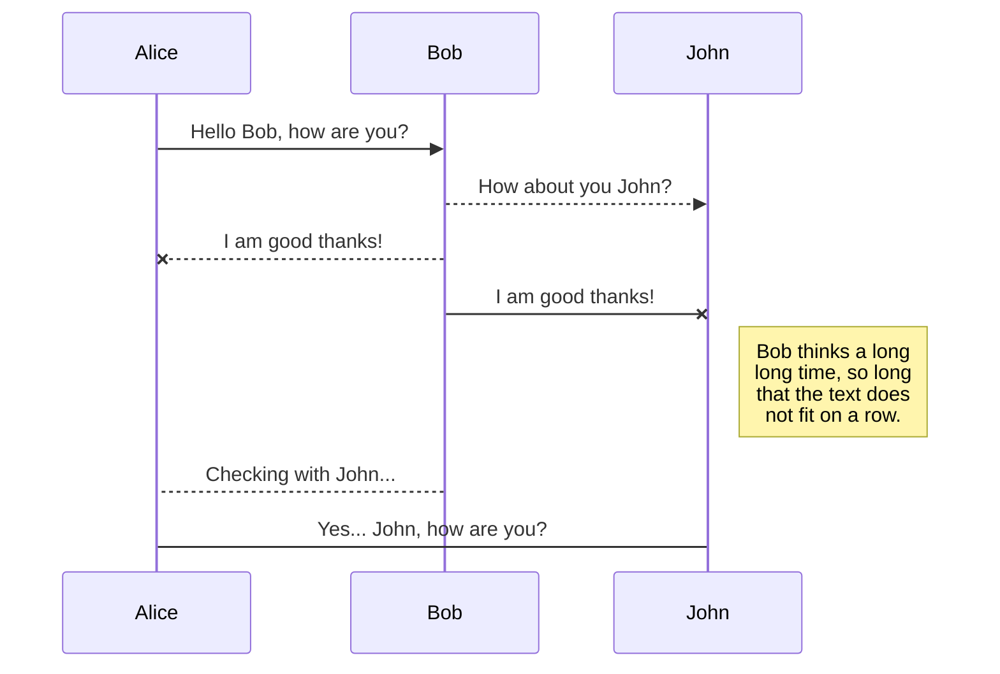
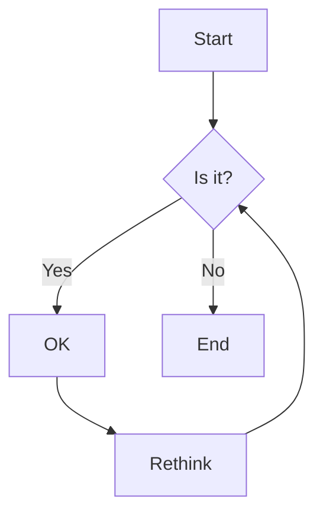

Spec-Up Example
==================

**Specification Status:** Draft

**Latest Draft:**
  [https://identity.foundation/spec-up](https://identity.foundation/spec-up)

Editors:
~ [Daniel Buchner](https://www.linkedin.com/in/dbuchner/)

Participate:
~ [GitHub repo](https://github.com/decentralized-identity/spec-up)
~ [File a bug](https://github.com/decentralized-identity/spec-up/issues)
~ [Commit history](https://github.com/decentralized-identity/spec-up/commits/master)

------------------------------------

## Abstract

Let's face it, other tools and generators for writing technical specifications aimed at standards bodies or industry groups are cumbersome, underwhelming, and lack the features you might want in a technical specification document. Spec-Up's goal is to deliver you a better spec-writing experience with far less effort and tedium than other tools in the ecosystem. Spec-Up is a simple tool that auto-generates great specs from markdown. The version of markdown Spec-up uses contains all the same features you might expect from common implementations, like GitHub, but adds much more, including notice blocks, complex tables, charts, advanced syntax highlighting, UML diagrams, etc.

## Getting Started

Using Spec-Up is easy peasy lemon squeezy:

1. `npm install spec-up`
2. Create a `specs.json` file **in the root folder of your repository** to specify configuration values used in the generation of your spec documents. The values in your `specs.json` file include things like where your spec's markdown files are located, where to output the generated spec document, and various metadata values used in rendering, such as the title, logo, and repo links for each of your specs. The following are the required/optional fields supported in the `specs.json` config file:

    - **`spec_directory`** _(STRING, required)_ - You must specify the **repo-root-relative** location of your spec's markdown file directory. You ****MUST**** name your spec's markdown file `spec.md` and locate it in your `spec_directory` for the tool to automatically find and use it for rendering. If you want to use a different name for the markdown file, or you have multiple markdown files you would like the tool to assemble into one document, you must specify them using the optional`markdown_paths` field described below. See the "multi-file" example in the spec-up repo.
    - **`title`** _(STRING, required)_ - You must add a title for your spec, which will be rendered in the generated document's H1 text and page title.
    - **`markdown_paths`** _(ARRAY, optional)_ - If you want to name your spec's markdown file something other than `spec.md`, or you have multiple files you would like assembled into a single output document, you must specify their paths as array entries in the order you would like them assembled. The paths in this array are assumed to be based on the `spec_directory` you specified, so _DO NOT_ repeat the full root relative path. 
    - **`katex`** _(BOOLEAN, optional)_ - To enable TeX support via KaTeX, set this property to `true`. After rendering, be sure to copy the `fonts/` subdirectory, containing the necessary web fonts.
    - **`output_path`** _(STRING, optional)_ - If you want the generated spec document to be output to a different location than the `spec_directory` you specified (e.g. the project root for GitHub Pages publishing) you can specify another root relative path (use `./` for root), and the tool will write the document file there instead.
3. In your main node.js file, drop in this bad boy: `require('spec-up')()`

Boom! That's it. Spec-Up will auto-detect modifications to files in your `spec_directory` and auto-generate your spec's updated HTML document every time you save a change.

**Usage**

If your `spec.json` and `package.json` and `package-lock.json` files are in working order and in the root folder of the repo from which it will be deployed, Spec-up can be called by command line (from the root of your repo) in three different modes:

|command|behavior|
|---|---|
|`npm run edit`|after rendering, this will stay running and the `gulp` library will watch the source files in your spec directory/ies for changes and re-render any time you save a file. Opening these rendered files in a browser and refreshing them will keep you up to date.|
|`npm run render`|this renders the site once and does not keep a gulpy watch on the underlying files.|
|`npm run dev`|this enables debugging features.|

## Table of Contents

<-- You see that beautiful TOC over there to your left? (tap the header link to slide it out on mobile) Yeah, you don't need to do a damn thing, that just magically appears based on your use of `h2`, `h3`, and `h4` headings.

## Term References

### Definition Lists

Many specs may want to include a section for terminology references, and Definition Lists are a great way to do that. Here's how to leverage Spec-Up's automatic term reference features via Definition List markup:

<pre>
[[def: Term 1, Term One]]:
~ This is the first term we will define.

[[def: Term 2, Term Two]]:
~ This is the second term, but not the last.

[[def: Term 3, Term Three]]:
~ This is the last term, because you know what they say: third term's the charm!
</pre>

[[def: Term 1, Term One]]:
~ This is the first term we will define.

[[def: Term 2, Term Two]]:
~ This is the second term, but not the last.

[[def: Term 3, Term Three]]:
~ This is the last term, because you know what they say: third term's the charm!

Now let's refer to some of the terms defined above to show how the auto-linking of terms works: [[ref: Term 1]], [[ref: Term Two]], [[ref: Term 3]]. Additionally, as long as you define your terms using Definition Lists (as seen in the markdown above), you will be able to hover any reference to a term to see a tooltip with its definition.

### Table-defined Terms

You can also reference table-oriented terms and definitions which are decomposed into heading-titled attributes in distinct cells:

<pre>
Variable           | Default Value | Max Value
------------------- | -------------- | ---------
[[def: Variable 1]] | 123          | 9999
</pre>

Variable            | Default Value | Max Value
------------------- | ------------- | ---------
[[def: Variable 1]] | 123           | 9999


Anytime you add a definition of a term in the first column of a table, like [[ref: Variable 1]], it will link to the cell and display a tooltip with the entire set of row values when you hover the term.

### External Term References

It is possible to include references to terms from external spec-up generated specifications. To include a source you would like to pull references from include an `external_specs` array in your spec config. The value should be a key/value object where the key is used in the external reference below and the value is the URL of the external spec. 

::: example
```json
{
  "specs": [
    {
      ...
      "external_specs": [
        {"PE": "https://identity.foundation/presentation-exchange"}
      ]
    }
  ]
}
```
:::

To include an external term reference within your spec use the following format `[[xref: {title}, {term}]]` where `{title}` is the title given to the spec in the config and `{term}` is the term being used. For example using the PE spec given in the example above [[xref: PE, Holder]]

## Blockquote

> To be, or not to be, that is the question: 
Whether 'tis nobler in the mind to suffer
The slings and arrows of outrageous fortune,
Or to take arms against a sea of troubles
And by opposing end them. To die—to sleep,
No more;

## Notices

<pre>
::: note Basic Note
  Check this out.
:::
</pre>

::: note Basic Note
  Check this out.
:::

::: note
  Here's another.
:::

::: note
  And one more!
:::

::: note Basic Note
  One last note!!!
:::

<pre>
::: issue Issue Notice
  I take issue with that, kind sir.
:::
</pre>

::: issue Issue Notice
  I take issue with that, kind sir.
:::

<pre>
::: warning Warning Notice
  Houston, I think we have a problem
:::
</pre>

::: warning Warning Notice
  Houston, I think we have a problem
:::


<pre>
::: todo Really Important
  Get this done!
:::
</pre>

::: todo Really Important
  Get this done!
:::


<pre>
::: example Code Example
  Put your code block here
:::
</pre>

::: example Code Example
```json
// Some comment in JSON
{
  "foo": "bar",
  "baz": 2
}
```
:::

## Content Insertion

Use the following format to pull in content from other files in your project:

<pre>
This text has been inserted here from another file: &#91;&#91;insert: ./single-file-test/assets/test.text&#93;&#93;
</pre>

This text has been inserted here from another file: [[insert: ./single-file-test/assets/test.text]]

You can even insert content within more complex blocks, like the JSON object below which is being pulled in and rendered in a syntax-highlighted example block:
<pre>
::: example Code Example
```json
&#91;&#91;insert: ./single-file-test/assets/test.json&#93;&#93;
```
:::
</pre>

::: example Code Example
```json
[[insert: ./single-file-test/assets/test.json]]
```
:::


## Tables

<pre>
Stage | Direct Products | ATP Yields
----: | --------------: | ---------:
Glycolysis | 2 ATP ||
^^ | 2 NADH | 3--5 ATP |
Pyruvaye oxidation | 2 NADH | 5 ATP |
Citric acid cycle | 2 ATP ||
^^ | 6 NADH | 15 ATP |
^^ | 2 FADH2 | 3 ATP |
**30--32** ATP |||
[Net ATP yields per hexose]
</pre>

Stage | Direct Products | ATP Yields
----: | --------------: | ---------:
Glycolysis | 2 ATP ||
^^ | 2 NADH | 3--5 ATP |
Pyruvaye oxidation | 2 NADH | 5 ATP |
Citric acid cycle | 2 ATP ||
^^ | 6 NADH | 15 ATP |
^^ | 2 FADH2 | 3 ATP |
**30--32** ATP |||
[Net ATP yields per hexose]

<pre>
|--|--|--|--|--|--|--|--|
|♜|  |♝|♛|♚|♝|♞|♜|
|  |♟|♟|♟|  |♟|♟|♟|
|♟|  |♞|  |  |  |  | |
|  |♗|  |  |♟|  |  | |
|  |  |  |  |♙|  |  | |
|  |  |  |  |  |♘|  | |
|♙|♙|♙|♙|  |♙|♙|♙|
|♖|♘|♗|♕|♔|  |  |♖|
</pre>

|--|--|--|--|--|--|--|--|
|♜|  |♝|♛|♚|♝|♞|♜ |
|  |♟|♟|♟|  |♟|♟|♟ |
|♟|  |♞|  |  |  |  |  |
|  |♗|  |  |♟|  |  |  |
|  |  |  |  |♙|  |  |  |
|  |  |  |  |  |♘|  |  |
|♙|♙|♙|♙|  |♙|♙|♙ |
|♖|♘|♗|♕|♔|  |  |♖ |

## Sequence Diagrams
<pre>

</pre>


## Flows

<pre>

</pre>


## Charts

<pre>
```chart
{
  "type": "pie",
  "data": {
    "labels": [
      "Red",
      "Blue",
      "Yellow"
    ],
    "datasets": [
      {
        "data": [
          300,
          50,
          100
        ],
        "backgroundColor": [
          "#FF6384",
          "#36A2EB",
          "#FFCE56"
        ],
        "hoverBackgroundColor": [
          "#FF6384",
          "#36A2EB",
          "#FFCE56"
        ]
      }
    ]
  }
}
```
</pre>

```chart
{
  "type": "pie",
  "data": {
    "labels": [
      "Red",
      "Blue",
      "Yellow"
    ],
    "datasets": [
      {
        "data": [
          300,
          50,
          100
        ],
        "backgroundColor": [
          "#FF6384",
          "#36A2EB",
          "#FFCE56"
        ],
        "hoverBackgroundColor": [
          "#FF6384",
          "#36A2EB",
          "#FFCE56"
        ]
      }
    ]
  }
}
```

## Syntax Highlighting

<pre>
```json
{
  "@context": "https://www.w3.org/ns/did/v1",
  "id": "did:example:123456789abcdefghi",
  "authentication": [{
    "id": "did:example:123456789abcdefghi#keys-1",
    "type": "RsaVerificationKey2018",
    "controller": "did:example:123456789abcdefghi",
    "publicKeyPem": "-----BEGIN PUBLIC KEY...END PUBLIC KEY-----\r\n"
  }],
  "service": [{
    "id":"did:example:123456789abcdefghi#vcs",
    "type": "VerifiableCredentialService",
    "serviceEndpoint": "https://example.com/vc/"
  }]
}
```
</pre>


```json
{
  "@context": "https://www.w3.org/ns/did/v1",
  "id": "did:example:123456789abcdefghi",
  "authentication": [{ 
    "id": "did:example:123456789abcdefghi#keys-1",
    "type": "RsaVerificationKey2018",
    "controller": "did:example:123456789abcdefghi",
    "publicKeyPem": "-----BEGIN PUBLIC KEY...END PUBLIC KEY-----\r\n"
  }],
  "service": [{
    "id":"did:example:123456789abcdefghi#vcs",
    "type": "VerifiableCredentialService",
    "serviceEndpoint": "https://example.com/vc/"
  }]
}
```

## TeX Math Equations

When the `katex` option is enabled, the KaTeX math engine is used for TeX rendering. You can find a list of supported features and examples here: https://katex.org/docs/supported.html.

$$\begin{pmatrix}x_2 \\ y_2 \end{pmatrix} = 
\begin{pmatrix} A & B \\ C & D \end{pmatrix}\cdot
\begin{pmatrix} x_1 \\ y_1 \end{pmatrix}$$

$$\def\arraystretch{1.5}
   \begin{array}{c:c:c}
   a & b & c \\ \hline
   d & e & f \\
   \hdashline
   g & h & i
\end{array}$$

$$
\underbrace{a+b+c}_{\text{Note: such math, much wow.}}
$$

## Tab Panels

<tab-panels selected-index="0">
  <nav>
    <button type="button">First Tab</button>
    <button type="button">Second Tab</button>
  </nav>

  <section>

```json
{
  "foo": "foo",
  "baz": 1
}
```

  </section>
  <section>

```json
{
  "foo": "bar",
  "baz": 2
}
```

  </section>
</tab-panels>

## Fancy Links

Spec-Up automatically upgrades the links of certain sites, like GitHub. GitHub is the only supported site with Fancy Links right now, but we'll be adding more as we go.

### GitHub

- **Issues**
  - Source: `https://github.com/decentralized-identity/presentation-exchange/issues/119`
  - Render: https://github.com/decentralized-identity/presentation-exchange/issues/119
- **Pull Requests**
  - Source: `https://github.com/decentralized-identity/sidetree/pull/863`
  - Render: https://github.com/decentralized-identity/sidetree/pull/863
- **Releases**
  - Source: `https://github.com/decentralized-identity/sidetree/releases/tag/v0.9.1`
  - Render: https://github.com/decentralized-identity/sidetree/releases/tag/v0.9.1
- **Projects**
  - Source: `https://github.com/decentralized-identity/sidetree/projects/1`
  - Render: https://github.com/decentralized-identity/sidetree/projects/1

## External Spec References

You can reference external specifications from IETF, W3C, and WHATWG as follows: 

1. Anywhere in your document you want to referece an external specification, use the `spec`-prefixed custom token format: `[[spec:RFC4122]]`
2. Wherever in your document you want to print out all your external specification references, use the `spec` custom token format _without any spec name_: `[[spec]]`
  - If you want to split up your references into groups (e.g. normative vs informative), just make sure to use dash-delimited unique reference grouping string in your custom tokens: `[[spec-norm:RFC4122]]`, `[[spec-inform:RFC4122]]`, `[[spec-foo:RFC4122]]`, etc.
  - To print out a custom group's references, just include the grouping string for a given set of references in a custom token _without any spec name_: `[[spec-norm]]`, `[[spec-inform]]`, `[[spec-foo]]`.

Here are a set of example references that are distributed among the reference groups `spec`, `spec-norm`, `spec-inform`:

- [[spec:RFC3548]] (`[[spec:RFC3548]]`)
- [[spec:RFC7518]] (`[[spec:RFC7518]]`)
- [[spec-norm:DID-CORE]] (`[[spec-norm:DID-CORE]]`)
- [[spec-norm:DID-SPEC-REGISTRIES]] (`[[spec-norm:DID-SPEC-REGISTRIES]]`)
- [[spec-inform:RFC6901]] (`[[spec-inform:RFC6901]]`)
- [[spec-inform:RFC7230]] (`[[spec-inform:RFC7230]]`)

### Default References

This is what is printed out when you include the `[[spec]]` custom token in your Markdown:

[[spec]]


### Normative References

This is what is printed out when you include the `[[spec-norm]]` custom token in your Markdown:

[[spec-norm]]

### Informative References

This is what is printed out when you include the `[[spec-inform]]` custom token in your Markdown:

[[spec-inform]]
